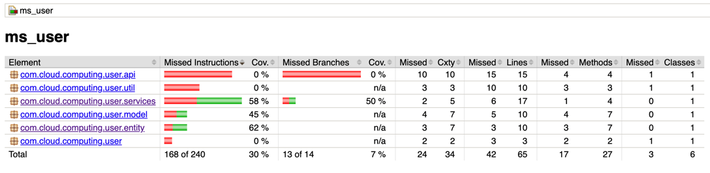
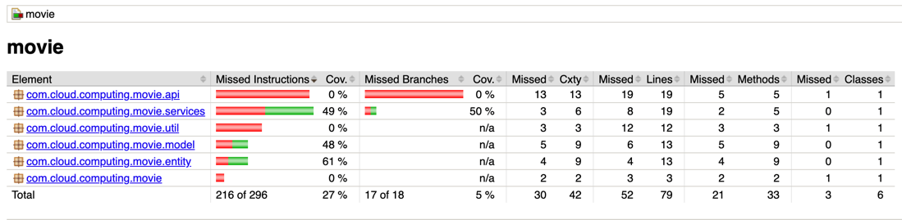
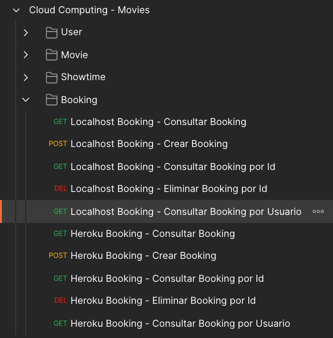
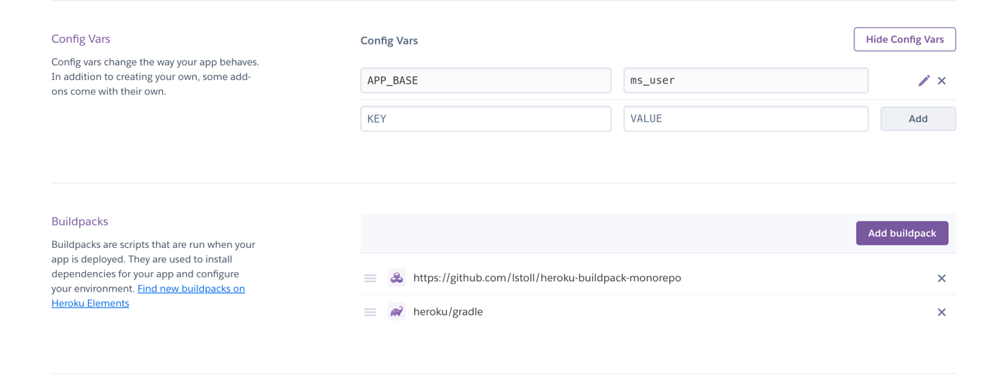

# mr_movie
Mono Repo - Trabajo del Poli - microservicio de Peliculas

El siguiente repositorio contiene 6 micro servisios
* ms_user
* ms_movie
* ms_showtime
* ms_booking
* ms_registry_services
* ms_config_server

Se realiza pruebas unitarias a los microservicios de
* ms_user

* ms_movie

### Collection Postman
En la siguiente ruta pueden encontrar la colección de postman con las peticiones para realizar los consumos en Localhost y desplegados 
`ms_movie/src/main/resources/static/Cloud Computing - Movies.postman_collection.json`
Pueden ver un ejemplo de la coleción donde se evidencias las peticiones, con el indicativo al iniciar LocalHost y Heroku para diferenciar los consumos de las API's

## Configuración Heroku

la configuración para desplegar desde un mono repositorio es la siguiente:

por cada componente dentro del mono repositorio, se debe crear una Apps dentro de Heroku.

Por cada Apps se debe configurar lo siguiente:

1. Crear una App por cada microservicio en Heroku
2. Vinculamos la App con el repositorio de GitHub o donde tengamos nuestro código fuente
3. Nos dirigimos a la configuración de la App
    1. En la sesión de Config Vars agregamos una variable APP_BASE que es la ruta del componente que vamos a desplegar dentro del mono repo
    2. en los Buildpacks agregamos de primero la URL https://github.com/lstoll/heroku-buildpack-monorepo y luego la del lenguaje que vamos a desplegar en nuestro caso Gradle

## Eureka Server
URL: https://ms-registry-service.herokuapp.com/

